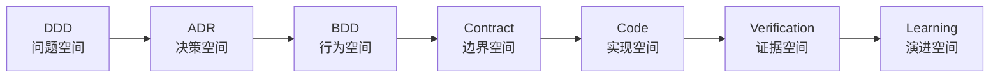

# AI原生多 Agent 研发系统：指导哲学、方法论与不可破坏的设计原则

> **文档一：指导哲学思路**

| 版本     | V1.1                                                |
|----------|-----------------------------------------------------|
| 日期     | 2026年7月                                           |
| 适用对象 | AI研发平台设计者、架构师、研发效能团队、Agent工程师 |
| 文档状态 | 设计基线 / 可迭代                                   |

核心主题：DDD × ADR × BDD × Contract × Testing × Loop × Human Collaboration × Skill × Subagent × Harness

# 文档定位

| 定位     | 定义系统的世界观、方法论和判断标准，回答“为什么这样设计”，并为后续架构、Agent、Skill、Workflow 和质量门禁提供共同语言。 |
|----------|-------------------------------------------------------------------------------------------------------------------------|
| 读者     | 产品负责人、架构师、研发效能团队、AI Agent 工程师、测试与运维负责人。                                                   |
| 使用方式 | 在需求评审、架构评审、Agent 设计、流程变更和故障复盘时作为原则基线；它不是具体技术实现说明。                            |

# 目录

> 1\. 执行摘要
>
> 2\. 问题重构：目标不是多 Agent，而是可验证交付
>
> 3\. 统一世界观：七个空间与三种责任
>
> 4\. 十二条指导原则
>
> 5\. DDD、ADR、BDD、契约与测试的统一关系
>
> 6\. Loop、Goal、Skill、Subagent 与 Harness 的分工
>
> 7\. AI 参与每一步的边界
>
> 8\. 证据、停止与失败哲学
>
> 9\. 人机协作与治理
>
> 10\. 人与 Loop 的关系：前置共创、长时自治与按需召回
>
> 11\. 反模式与设计禁区
>
> 12\. 成熟度模型
>
> 13\. 设计宣言
>
> 14\. 参考资料与术语依据

# 1. 执行摘要

| **一句话定义：**这是一个以领域理解和行为契约为起点、以确定性证据为完成标准、由外部 Harness 编排多个可替换 Agent 持续收敛的软件交付系统。 |
|------------------------------------------------------------------------------------------------------------------------------------------|

系统不应被理解为“代码 Agent、测试 Agent、部署 Agent 的串联”。这种理解只描述了角色，没有说明正确性从哪里来、失败后如何回退、什么时候停止、经验如何复用。真正需要设计的是一套机器可执行的软件工程制度。

- **DDD 定义问题空间：**先建立业务边界、统一语言与不变量，再讨论实现。

- **ADR 显式化解空间：**架构选择必须比较备选、记录取舍，并转成对代码 Agent 可执行的约束。

- **BDD 定义可观察行为：**需求必须能表达为用户或系统可观察的 Given-When-Then。

- **契约锁定边界：**接口、事件、数据结构和错误语义不能随实现任意漂移。

- **测试建立证据：**单元测试验证局部规则，契约测试验证边界兼容，接口测试验证运行行为。

- **Loop 驱动收敛：**每个循环都有目标、验证、失败路由、预算与终态。

- **Harness 承担治理：**状态、权限、上下文、沙箱、日志、质量门禁和人工审批不交给模型自由发挥。

图 1 从问题理解到经验演进的完整链路

# 2. 问题重构：目标不是多 Agent，而是可验证交付

多 Agent 只是组织形式。系统的真实目标是：在有限权限、有限上下文和有限成本下，把一个模糊需求稳定地转化为可维护、可部署、可验证、可追溯的代码变更。

| **常见表述**           | **隐藏问题**                               | **正确重构**                                             |
|------------------------|--------------------------------------------|----------------------------------------------------------|
| 让代码 Agent 写功能    | 代码不知道业务边界，也不能证明正确         | 让实现 Agent 在领域模型、ADR 和契约约束下提交候选变更    |
| 让测试 Agent 验证      | 同一模型可能迎合自己写的实现               | 独立生成验证意图，由确定性工具执行，并由不同角色分析失败 |
| 测试通过就结束         | 测试可能缺失，环境可能错误，接口可能不兼容 | 通过分层门禁和需求到证据的追踪矩阵声明完成               |
| 失败就继续提示         | 无限重试会产生漂移、奖励投机和成本失控     | 失败分类后回退到最早错误来源，并受重试预算约束           |
| Agent 经验写进长提示词 | 上下文膨胀且规则难维护                     | 稳定知识进入 Skill、策略、检查器和项目文档               |

| **核心转变：**从“模型能不能生成代码”转向“模型—Harness—环境能不能产出可验证、可归因、可维护的变更”。 |
|-----------------------------------------------------------------------------------------------------|

# 3. 统一世界观：七个空间与三种责任

| **空间** | **核心问题**                         | **主要产物**                           | **主要验证**                                |
|----------|--------------------------------------|----------------------------------------|---------------------------------------------|
| 领域空间 | 业务到底是什么，边界和不变量是什么？ | 领域模型、统一语言、上下文地图         | 术语一致性、不变量完整性、与现有系统映射    |
| 决策空间 | 为什么选择这个实现方向？             | ADR、备选方案、后果、约束              | 方案比较、风险审查、架构规则检查            |
| 行为空间 | 外部应该观察到什么？                 | Feature、Scenario、验收准则            | 可执行性、覆盖度、无实现泄漏                |
| 契约空间 | 组件之间承诺什么？                   | OpenAPI、事件 Schema、Pact、数据契约   | Schema 校验、兼容性、Provider/Consumer 验证 |
| 实现空间 | 如何最小化地实现？                   | 代码 Diff、迁移、配置                  | 编译、静态检查、架构规则                    |
| 证据空间 | 如何证明变更成立？                   | 测试结果、构建日志、接口响应、审查结论 | 确定性命令、质量门禁、追踪矩阵              |
| 演进空间 | 这次经验如何减少下次错误？           | Skill、策略、检查器、失败模式库        | 复用效果、故障复发率、成本变化              |

## 三种责任必须分离

- **生成责任：**AI 提出领域模型、方案、场景、代码和测试候选。

- **判断责任：**独立 Reviewer、规则检查器和人类对候选进行批判与选择。

- **证明责任：**编译器、测试框架、契约验证器、运行环境和证据链证明结果。

| **不可替代原则：**模型的自信、解释或总结都不能替代可复现的执行证据。 |
|----------------------------------------------------------------------|

---

[返回文档索引](./guiding-philosophy.md) · [下一部分](./guiding-philosophy-part-2.md)
